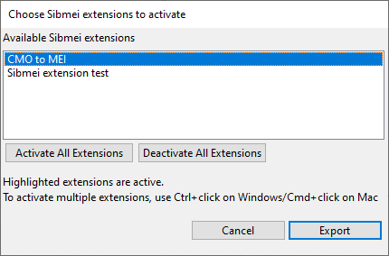

# Extension API

With extensions to Sibmei, text objects and symbols can be exported in a customized way. This allows addressing custom symbols and text styles and project specific needs.

Extensions are regular Sibelius plugins written in ManuScript. When running Sibmei, it scans for extension plugins. Users can choose which extensions to activate when running Sibmei. Multiple extensions can be activated simultaneously.



## Example

```js
{
  // The `SibmeiExtensionAPIVersion` field must be present so Sibmei can
  // recognize compatible extensions
  SibmeiExtensionAPIVersion "1.0.0"

  Initialize "() {
    // The extension choice dialog will list this extension as
    // 'Example extension' (the first argument to to AddToPluginsMenu()).
    // Second argument can be `null` because an extension plugin does not need a
    // `Run()` method.
    AddToPluginsMenu('Example extension', null);
  }"

  // InitSibmeiExtension() is the entry point for Sibmei and must be present
  // for Sibmei to recognize an extension plugin.
  InitSibmeiExtension "(api) {
    // It is recommended to register the api and libmei objects as global
    // variables:
    Self._property:api = api;
    Self._property:libmei = api.libmei;

    // Declare which text styles this extension handles
    api.RegisterTextHandlers(CreateDictionary(
      // Text objects can be matched either by their StyleId or StyleAsText
      // property. Here, we match by StyleAsText.
      'StyleAsText', CreateDictionary(
         // We want the HandleMyText() method to handle Text objects matching
         // textObj.StyleAsText = 'My text'
        'My text', 'HandleMyText'
      )
    ), Self);
  }"

  HandleMyText "(_, textObj) {
    // Create and return an MEI element that Sibmei will append as a child to
    // the measure element.
    textElement = api.GenerateControlEvent(textObj, 'AnchoredText');
    api.AddFormattedText(textElement, textObj);
    return textElement;
  }"
}
```

See [another example](./lib/sibmei4_extension_test.plg) for code handling symbols.

## Required Data

### `ExtensionAPIVersion`

A [semantic version string](https://en.wikipedia.org/wiki/Software_versioning#Degree_of_compatibility) specifying for which version of the Sibmei extension
API the extension was written. The current API version of Sibmei can be found in
[`GLOBALS.mss`](./src/GLOBALS.mss).

The API is guaranteed to remain backwards compatible with newer releases that retain the same major version number for `ExtensionAPIVersion`. With minor version numbers, new functionality is added while existing functionality remains backwards compatible.

## Required Methods

### Symbol or Text Handlers

The core purpose of an extension is to define symbol and text handlers to export Sibelius objects in custom ways. (See `HandleMyText()` in the above [example](#example))  These handlers take two arguments:

* `this`: a Dictionary that is passed for technical reasons and *must be ignored by the extension*
* a Sibelius object (`SymbolItem` or `SystemSymbolitem` for symbol handlers, `Text` or `SystemTextItem` for text handlers)

A text handler should return an MEI element (created using libmei) that
Sibmei will append to the `<measure>` element.  If `null` is returned instead,
the object will not be exported.

A symbol handler should either call the `HandleModifier()` or `HandleControlEvent()` methods. If neither is called, the object will not be exported. Symbol handlers needn't return anything.

### `InitSibmeiExtension()`

Sibmei calls this method and passes an API Dictionary as argument (see below).
Register your symbol and text handlers in this function using `RegisterSymbolHandlers()` and `RegisterTextHandlers()` (see below).

## API Dictionary

### Interaction with Sibmei

Extensions must only interact with Sibmei through the API dictionary passed to `InitSibmeiExtension()` because Sibmei's core methods may change at any point. If an extension requires access to functionality that is not exposed by the API dictionary, [create an issue](https://github.com/music-encoding/sibmei/issues/new) or a pull request on GitHub.

### API data and methods

The API dictionary exposes the following object:

* **`libmei`**: A reference to libmei that can be used to construct and
   manipulate MEI elements. *This dictionary must not be modified.*

It exposes the following methods that must only be called in the initialization phase:

* **`RegisterSymbolHandlers()`**: Call this function to make a symbol handler
   known to Sibmei. To tell Sibmei which symbols the extension handles, the symbols must be
   registered by their `Index` or `Name` property. For built-in
   symbols, always use the `Index` property, for custom symbols, always use the
   `Name` property.

   The Dictionary that needs to be passed to `RegisterSymbolHandlers()` has the
   following structure:

   ```
   CreateDictionary(
      'Name', CreateDictionary(
         'My custom symbol', 'MyCustomSymbolHandler',
         'My other custom symbol', 'MyAlternativeCustomSymbolHandler'
      ),
      'Index', CreateDictionary(
         myIndex, 'MyCustomSymbolHandler',
         myOtherIndex, 'MyCustomSymbolHandler'
      )
   )
   ```

   If Sibmei finds a symbol with a `Name` or `Index` property matching a key in
   the respective sub-Dictionaries, it will call the symbol handler registered
   under that key. A method of that name must be present in the extension
   plugin.

   If no symbols are registered by either `Name` or `Index` property, the
   respective sub-dictionaries can be omitted.

   Second argument of `RegisterSymbolHandler()` must be `Self`.

* **`RegisterTextHandlers()`**: Works the same way as
   `RegisterSymbolHandlers()`, with the difference that sub-Dictionary keys are
   `StyleId` and `StyleAsText` instead of `Index` and `Name`. Always use
   `StyleId` for built-in text styles and `StyleAsText` for custom text styles.

The following methods must only be used by handler methods:

* **`MeiFactory()`**: A convenience method that takes a template SparseArray as
   argument and generates an MEI element from it. For detailed information, see
   the documentation comments in [`Utilities.mss`](./src/Utilities.mss).

   It is recommended to define template dictionaries as global variables in the
   `InitSibmeiExtension()` method instead of defining them locally in the symbol
   handler methods.

* **`HandleControlEvent()`**:  Pass this function two arguments:

   * The to be exported `SymbolItem` or `SystemSymbolItem`
   * A template suitable for passing to `MeiFactory()`

   `HandleControlEvent()` creates an MEI element and attaches it to the `<measure>` element. It returns the element for further manipulation by the extension plugin.

* **`HandleModifier()`**: Works similarly to `HandleControlEvent()`, but attaches the generated MEI element to an event element (`<note>`, `<chord>` etc.) instead of the `<measure>` element.

* **`AddFormattedText()`**: Takes arguments:

   * `parentElement`: MEI element that the formatted text nodes should be appended to
   * `textObj`: A  `Text` or `SystemTextItem` object. Its `TextWithFormatting` property is converted to MEI markup.

* **`GenerateControlEvent()`**: Takes two arguments:

   * `bobj`: A `BarObject`
   * `elementName`: Capitalized MEI element name, e.g. `'Line'`.

   Uses the `elementName` to generate an MEI element and adds applicable control event attributes (see  `AddControlEventAttributes`)

* **`AddControlEventAttributes()`**:  Takes two arguments:

   * `bobj`: A `BarObject`
   * `element`: An MEI element

   Adds the following control event attributes:

   * `@startid` (if a start object could be identified) and `@tstamp`
   * If applicable (e.g. for lines), `@endid` (if an end object could be identified) and `@tstamp2`
   * `@staff` (if object is staff-attached)
   * `@layer`
   * For lines:
     * `@dur.ppq` (unless `Duration` is 0)
     * `@startho`, `@startvo`, `@endho`, `@endvo`
   * For elements other than lines:
     * `@ho`, `@vo`
