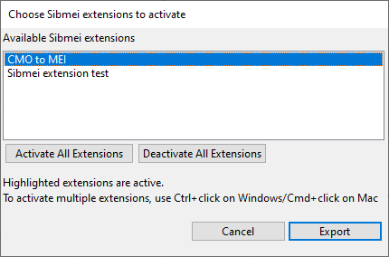

# Extension API

With extensions to Sibmei, text objects, symbols and lines can be exported in a customized way. This allows addressing custom symbols and text styles and project specific needs.

Extensions are regular Sibelius plugins written in ManuScript. When running Sibmei, it scans for extension plugins. Users can choose which extensions to activate when running Sibmei. Multiple extensions can be activated simultaneously.



## Example

```js
{
  //"The `SibmeiExtensionAPIVersion` field must be present so Sibmei can"
  //"recognize compatible extensions"
  SibmeiExtensionAPIVersion "3.0.0"

  Initialize "() {
    // The extension choice dialog will list this extension as
    // 'Example extension' (the first argument to to AddToPluginsMenu()).
    // Second argument can be `null` because an extension plugin does not need a
    // `Run()` method.
    AddToPluginsMenu('Example extension', null);
  }"

  //"InitSibmeiExtension() is the entry point for Sibmei and must be present"
  //"for Sibmei to recognize an extension plugin."
  InitSibmeiExtension "(api) {
    // Declare which text styles this extension handles
    api.RegisterTextHandlers('StyleAsText', 'ControlEventTemplateHandler', CreateDictionary(
      // We want to add support for Text objects matching
      //   textObj.StyleAsText = 'My text'
      // Sibmei will append the generated element to the measure element.
      'My text', @Element('AnchoredText', null, api.FormattedText)
    ), Self);
  }"
}
```

See [another example](./test/extension_test.plg) for an extension plugin that also handles symbols, lines and lyrics.

## Required fields and methods

### `SibmeiExtensionAPIVersion`

A [semantic version string](https://en.wikipedia.org/wiki/Software_versioning#Degree_of_compatibility) specifying for which version of the Sibmei extension
API the extension was written. The current API version of Sibmei can be found in
[`GLOBALS.mss`](./tree/develop/src/GLOBALS.mss).

Extensions remain compatible with newer Sibmei versions as long as Sibmei does not change the major version number. When minor version numbers change, new functionality is added while existing functionality remains backwards compatible.

### `InitSibmeiExtension()`

Sibmei calls this method and passes an API Dictionary as argument (see below).
Register your symbol, text, line and lyrics Handlers in this function using the methods listed [below](#api-data-and-methods).

### Optional fields

### `CustomSchemaLocation`

By default, Sibmei writes schema validation processing instructions with the URL of the mei-CMN schema. A custom schema location can be declared as `CustomSchemaLocation`. If this field is `noSchema`, Sibmei will not write the validation processing instructions.

See the examples for how to [declare a custom schema location](./tree/develop/test/extension_specific_schema.plg) and how to [omit the processing instructions](./tree/develop/test/extension_test_omitting_schema.plg). Note that if multiple extensions are active and declare conflicting schema locations, you will be notified and no processing instructions are written.

## API Dictionary

### Interaction with Sibmei

Extensions must only interact with Sibmei through the API dictionary that is passed to `InitSibmeiExtension()` and Handler methods because Sibmei's core methods may change at any point. If an extension requires access to functionality that is not exposed by the API dictionary, [create an issue](https://github.com/music-encoding/sibmei/issues/new) or a pull request on GitHub.

### API data and methods


The API dictionary exposes the following [methods for registering Handlers](ExportHandlers.md#creating-and-registering-handlers) that must only be used inside the `InitSibmeiExtension()` method:

* **`RegisterSymbolHandlers()`**
* **`RegisterTextHandlers()`**
* **`RegisterLineHandlers()`**
* **`RegisterLyricHandlers()`**

The following methods can be used by Handler methods:

* [**`AddFormattedText()`** ](ExportHandlers.md#addformattedtext)
* [**`GenerateControlEvent()`**](ExportHandlers.md#generatecontrolevent)
* [**`GenerateModifier()`**]((ExportHandlers.md#generatemodifier))
* **`AppendToMeasure()`**. Use this if an element is measure-attached like a control event, but the element should not receive the control event attributes that `GenerateControlEvent()` would add. Takes a single argument, which is the element to be appended to the measure.
* [**`MeiFactory()`**](ExportHandlers.md#meifactory)

Methods for XML manipulation can be found in the [list of methods exposed to extensions](ExtensionApiMethods.md).
